<link href="type.css" rel="stylesheet" ></link>

若泰建设工程标准风险库管理平台用户手册 
 
 
     
<table border=1 align="center">
<tr>
<td rowspan="4">文件状态： 
&ensp;[&ensp;]草稿 
&ensp;[√]正式发布 
&ensp;[&ensp;]正在修改 </td>
<td>文件编号：
<td>Telsafe-SPI-VER-ForegroundApplication</td>
</tr>
<tr>
<td>当前版本： 
<td>V1.0</td>
</tr>
<tr>
<td>作    者： 
<td>胡靖</td>
</tr>
<tr>
<td>更新日期：</td>
<td>2017-09-20</td>
</tr>
</table>
 
 

上海同是工程科技有限公司

 
 
 
 
 
 

历史版本
 
 

| 日期 | 版本 | 作者 | 修订内容
| :-: | :-: | :-: |  :- |
| 2017/08/28 | V1.0| 胡靖 | 初始内容 
| 2017/10/25 | V1.1 | 胡靖 |  项目名称修改

 
 
 
 

目录

<!-- TOC -->

- [1.文档介绍](#1文档介绍)
    - [1.1.文档目的](#11文档目的)
    - [1.2.读者对象](#12读者对象)
    - [1.3.编写约定](#13编写约定)
        - [**通用格式约定**](#通用格式约定)
        - [**图形界面格式约定**](#图形界面格式约定)
        - [**键盘操作约定**](#键盘操作约定)
        - [**鼠标操作约定**](#鼠标操作约定)
        - [**特别标志**](#特别标志)
- [2.运行环境](#2运行环境)
- [3.使用说明](#3使用说明)
    - [3.1.登录页](#31登录页)
        - [3.1.1.操作步骤](#311操作步骤)
    - [3.2.首页](#32首页)
        - [3.2.1.操作步骤](#321操作步骤)
    - [3.3.属性管理](#33属性管理)
        - [3.3.1.操作步骤](#331操作步骤)
    - [3.4.行业管理](#34行业管理)
        - [3.4.1.操作步骤](#341操作步骤)
    - [3.5 工程管理](#35-工程管理)
        - [3.5.1.操作步骤](#351操作步骤)
    - [3.6.分部管理](#36分部管理)
        - [3.6.1.操作步骤](#361操作步骤)
    - [3.7.标准数据管理](#37标准数据管理)
        - [3.7.1.操作步骤](#371操作步骤)
    - [3.8. 数据导入](#38-数据导入)
        - [3.8.1.操作步骤](#381操作步骤)
    - [3.9 版本变更记录管理](#39-版本变更记录管理)
        - [3.9.1.操作步骤](#391操作步骤)
    - [3.10. 数据导入](#310-数据导入)
        - [3.10.1.操作步骤](#3101操作步骤)
    - [3.11.平台项目配置](#311平台项目配置)
        - [3.11.1.操作步骤](#3111操作步骤)
    - [3.12.项目数据管理](#312项目数据管理)
        - [3.12.1.操作步骤](#3121操作步骤)
- [4.常见问题](#4常见问题)

<!-- /TOC -->
 
 

# 1.文档介绍
## 1.1.文档目的
&ensp;&ensp;&ensp;&ensp;此文档主要是编写 若泰 建设工程标准风险库管理平台系统中所有功能模块的使用手册。用于辅助用户在使用管理系统时的参考。
## 1.2.读者对象
&ensp;&ensp;&ensp;&ensp;产品设计人员、实施人员、施工人员、业主、分监控中心人员等。
## 1.3.编写约定
### **通用格式约定**
| 格式| 意义 | 
| :- | :- | 
| 宋体+五号 | 正文说明 |
| 黑体+五号 | 功能的操作说明 | 
| 黑体+10+黑色 | 截图上的文字标识|
| 下划线 | 超链接文字 | 
| 斜体 | 提示信息 |
### **图形界面格式约定**
| 格式 | 意义 | 
| :- | :- | 
| “” | 窗口名称 |
| [ ] | 普通菜单项或树状结构菜单项 | 
| 【】 | 窗口中的按钮 |
| < > | 窗体中的选项 | 
| → | 连续选择菜单及其子菜单或树状结构 |
### **键盘操作约定**
| 格式 | 意义 | 
| :- | :- | 
| [键1] | 键盘上的键名|
| [键1+键2] | 在键盘上同时按下两个键 | 
### **鼠标操作约定**
| 格式 | 意义 | 
| :- | :- | 
| 单击 | 按下鼠标左键单击某一对象 |
| 双击 | 连续两次鼠标左键打开某一对象 | 
| 右击 | 选中某一对象按下鼠标右键 |
| 拖放 | 按住鼠标左键不放移动鼠标到指定位置，放开鼠标键 | 
| 放置 | 鼠标放置在窗口中的某一元素上 |
### **特别标志**
| 格式 | 意义 | 
| :- | :- | 
| 温馨提示： | 提醒某些事项 |
| 注意： | 提供一些应用关键的描述 | 
| 举例： | 列举实例以便用户加深理解 |
| 操作前提： | 进行某一操作之前，必须先完成的操作 |
| 定义： | 定义内容中出现的计算机术语 |

# 2.运行环境
| 环境 | 环境详情 | 备注 |
| :- | :- | :- |
| 硬件环境（最低配置） | Intel P4 处理器、2G内存、200G硬盘 ||
| 操作系统 | Window 2003、Window XP、Window 7、Window 8、Vista ||
| 浏览器 | IE8、IE9、IE10、IE11、360浏览器 ||

# 3.使用说明
## 3.1.登录页
&ensp;&ensp;&ensp;用于登录账号校验，账号密码正确进入系统 
### 3.1.1.操作步骤
打开浏览器，输入项目网址，进入“登录系统”主界面： 

 
> 温馨提示： 
>>输入用户名、密码正确进入首页，否则提示错误信息登录失败
    
## 3.2.首页
&ensp;&ensp;&ensp;统计当前最新版本下的表单和检查项数量、提供行业类型、工程类型、具体表单名称筛选，及对应表单、细类、检查项的数量统计、具体数据显示
### 3.2.1.操作步骤
打开浏览器，输入项目网址，登录系统，进入“首页”主界面: 

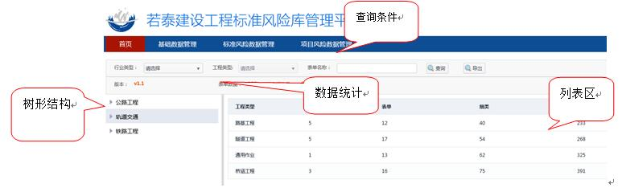 

A.1.<查询条件>区域，选择行业类型、工程类型、输入表单名称； 

A.2.点击【查询】按钮，左侧<树形结构>显示符合查询条件的名称节点及以下节点 

A.3.点击<树形结构>名称前面的展开图标可展开其下节点也可收缩只显示一级节点 

A.4.点击左侧<树形结构>节点,右侧<列表区>显示该节点下对应的节点及数量 

A.5.点击<树形结构>中最后一级节点（即表单名称），右侧显示该表单下的所有已启用的细类列表记录，如图： 

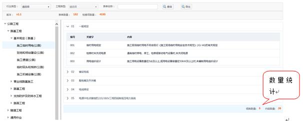 

A.6.点击右侧细类编号前面的展开图标 ，可展开列表显示该细类下的所有已启用的检查项记录；再点击收缩图标 收起检查项列表区域 

A.7.右侧列表下方<数量统计>区，统计该表单下的细类数量和所有已启用检查项数量 

B.点击【导出】按钮，弹出导出框，如下： 

 

> 温馨提示： 
>>导出框中显示所有已启用行业类型供选择

B.1.<导出框>中勾选要导出的行业类型复选框，可多选 

B.2.点击【确定】按钮，以excel文件格式导出选的行业类型下的所有表单检查项记录，多个行业类型，每个行业类型一个sheet显示，导出excel内容如图： 

 

> 温馨提示： 
>>1.上图excel显示不全，导出excel中显示出工程类型、分部工程、表单名称、表单分类、工序、关键字、检查项、所有已启用属性列及对应值 
>>2.备注列：如果备注信息显示“有备注”，否则显示空白

 C.<数据统计>区域显示当前版本号，该版本号已有表单及检查项数据统计
## 3.3.属性管理
&ensp;&ensp;&ensp;对固定属性启用禁用、其下内容维护；另外可自定义属性并进行编辑、启用禁用维护。
### 3.3.1.操作步骤
打开浏览器，输入项目网址，登录系统，单击菜单栏区域的[基础数据管理]→[属性管理]，进入“属性管理”主界面： 

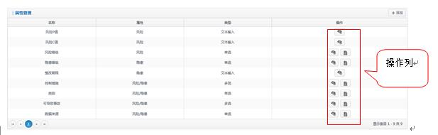 

> 温馨提示： 
>>1.类型为文本输入的记录<操作列>显示：启用/禁用 
>>2.类型非文本输入的固定属性记录<操作列>显示：启用/禁用、内容 
>>3.自定义属性记录<操作列>显示：编辑、启用/禁用

 A.单击【添加】按钮，弹出添加框： 
 
 

A.1.在<配置项>中输入、选择各项内容，单击【保存】按钮 

 

> 温馨提示： 
>>配置项后面的“*”代表该项为必填项

B.在<操作列>中点击，弹出禁用提示： 

 

B.1.点击【确认】按钮，禁用该记录，图标变为启用图标 

B.2.点击【取消】按钮，关闭弹出框，取消此次操作 

C.在<操作列>中点击，弹出启用提示： 

C.1.点击【确认】按钮，启用该记录，图标变为禁用图标 

C.2.点击【取消】按钮，关闭弹出框，取消此次操作 

D.在<操作列>中点击，弹出编辑框： 

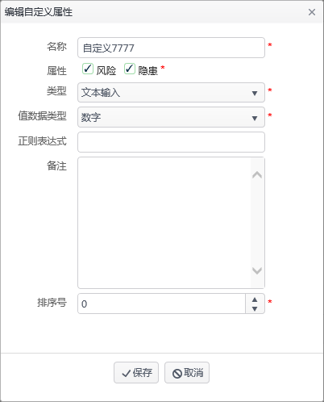 

D.1.修改各项内容，单击【保存】按钮 

> 温馨提示： 
>>1.默认加载各项内容，类型不可修改，其他均可修改 
>>2.配置项判断规则同添加

E.在<操作列>中点击，弹出属性数据框，如下图： 

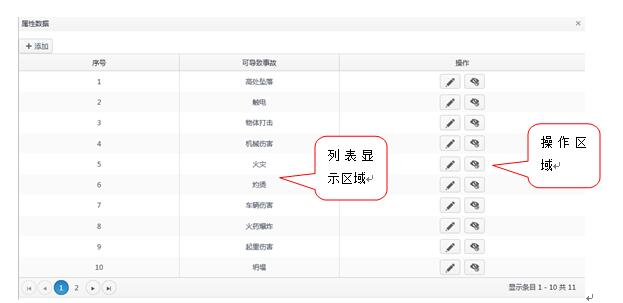 

E.1.<列表显示区域>显示点击的属性记录下已配置的内容记录 

E.2.点击【添加】按钮，弹出添加框，如下图： 

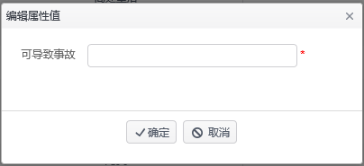 

E.2.1.输入框输入名称 

E.2.2.点击【确定】按钮，保存内容记录 

E.2.3.点击【取消】按钮，关闭弹出框，取消此次操作 

> 温馨提示： 
>>添加框中的名称标题为进入该弹出框点击的属性名称

E.3.点击<操作区域>中的 ，弹出编辑框，同添加框，显示标题名称 

E.3.1.修改显示的标题输入框，点击【确定】保存 

E.3.2.点击【取消】按钮，关闭编辑框，取消编辑操作 

E.4.点击<操作区域>中的，弹出禁用提示框： 

 

E.4.1.点击【确定】按钮，禁用该属性内容 

E.4.2.点击【取消】按钮，关闭提示框，取消禁用操作 

E.5.点击<操作区域>中的，弹出启用提示框： 

 
E.5.1.点击【确定】按钮，启用该属性内容 
E.5.2.点击【取消】按钮，关闭提示框，取消启用操作 

## 3.4.行业管理
&ensp;&ensp;&ensp;对行业类型记录进行维护。
### 3.4.1.操作步骤
打开浏览器，输入项目网址，登录系统，单击菜单栏区域的[基础数据管理]→[行业管理]，进入“行业类型管理”主界面： 

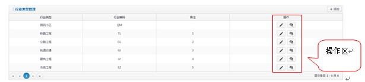 

>温馨提示： 
>>1.列表显示已有的行业类型记录 
>>2.按照顺序号排序显示

A.单击【添加】按钮，显示添加窗口： 

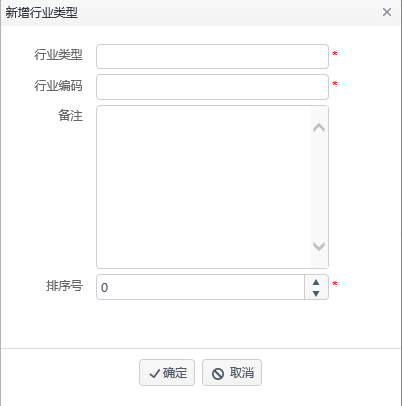 

A.1.填写<行业类型>、<行业编码>、<备注>、选择<排序号> 

A.2.单击【确认】按钮 

>注意： 
>>1.<行业类型>不可重复 
>>2.<行业编码>只可输入两位大写英文字符且不可重复

B.选中某一条行业记录，单击<操作区>中的图标，编辑界面同添加，此处略 

C.选中某一条行业记录，单击<操作区>中的按钮，弹出确认禁用提示框，点击【确认】，禁用该行业记录；点击【取消】按钮，取消此次禁用操作 

D.选中某一条行业记录，单击<操作区>中的按钮，弹出确认启用提示框，点击【确认】，启用该行业记录；点击【取消】按钮，取消此次启用操作

## 3.5 工程管理
&ensp;&ensp;&ensp;&ensp;对工程类型记录进行维护。
### 3.5.1.操作步骤
打开浏览器，输入项目网址，登录系统，单击菜单栏区域的[基础数据管理]→[工程管理]，进入“工程类型管理”主界面： 

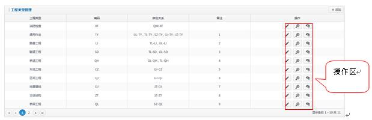 

>温馨提示： 
>>1.列表显示已有工程类型记录 
>>2.按照顺序号排序显示 
>>3.如果某工程类型对应的行业类型被禁用，则绑定关系列显示空

A.单击【添加】按钮，显示添加窗口： 

 

A.1填写<工程类型>、<编码>、<备注>、选择<行业类型>、<排序号> 

A.2.单击【确定】按钮

>注意： 
>>1.<工程类型>、<编码>不可重复 
>>2.<编码>只能输入两位大写英文字符 
>>3.<行业类型>可多选

B.选中某一条工程类型记录，单击<操作区>中的图标，编辑界面同添加，此处略 

C.选中某一条工程类型记录，单击<操作区>中的按钮，弹出确认禁用提示框，点击【确认】，禁用该工程类型记录；点击【取消】按钮，取消此次禁用操作 

D.选中某一条工程类型记录，单击<操作区>中的按钮，弹出确认启用提示框，点击【确认】，启用该工程类型记录；点击【取消】按钮，取消此次启用操作 

E.选中某一条工程类型记录，单击<操作区>中的，跳转至分部工程页面，如下图： 

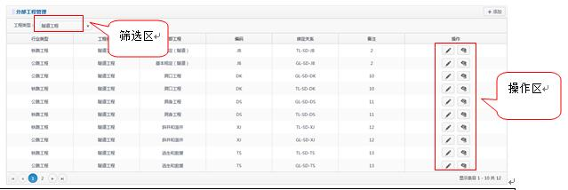 

>温馨提示： 
>>1.列表显示点击的工程类型下的所有分部工程记录 
>>2.<筛选区>默认定位显示点击的工程类型名称 
>>3.工程类型下拉框显示已启用的工程类型名称

E.1.选择<筛选区>工程类型下拉框，列表刷新显示该工程类型下的所有分部工程记录 

E.2.单击【添加】按钮，显示添加窗口： 

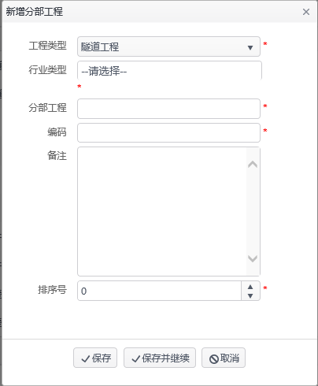 

E.2.1.选择<工程类型>、<行业类型>、<排序号>，输入<分部工程>、<编码>、<备注> 

E.2.2.单击【保存】按钮 

>温馨提示： 
>>1选择同一个工程类型，<分部工程>、<编码>不可再次重复； 
>>2.<行业类型>可多选 
>>3.<编码>只能输入两位大写英文字符 
>>4.从工程类型页面进入分部工程页面，添加框中工程类型默认定位显示选择的工程类型名称

E.2.3.跳过2.2.点击【保存并继续】按钮，保存信息成功后弹出框不关闭，可继续输入信息再次保存 

E.3.选中某一条分部工程记录，单击<操作区>中的图标，编辑界面同添加，此处略 

E.4.选中某一条分部工程记录，单击<操作区>中的按钮，弹出确认禁用提示框，点击【确认】，禁用该分部工程记录；点击【取消】按钮，取消此次禁用操作 

E.5.选中某一条分部工程记录，单击<操作区>中的按钮，弹出确认启用提示框，点击【确认】，启用该分部工程记录；点击【取消】按钮，取消此次启用操作

## 3.6.分部管理
&ensp;&ensp;&ensp;&ensp;对分部工程记录进行维护
### 3.6.1.操作步骤
打开浏览器，输入项目网址，登录系统，单击菜单栏区域的[基础数据管理]→[分部工程管理]，进入“分部工程管理”主界面，同3.5.1中的E，此处略 

>温馨提示： 
>>1.进入主界面，工程类型下拉框默认显示“请选择”，列表显示所有分部工程记录 
>>2.添加框中“工程类型”默认显示“请选择” 
>>3.分部工程对应的行业类型被禁用后该分部工程记录不显示

## 3.7.标准数据管理
&ensp;&ensp;&ensp;&ensp;进行表单、工序、检查项维护。
### 3.7.1.操作步骤
打开浏览器，输入项目网址，登录系统，单击菜单栏区域的[标准风险数据管理]→[标准数据管理]，进入“标准数据管理”主界面： 

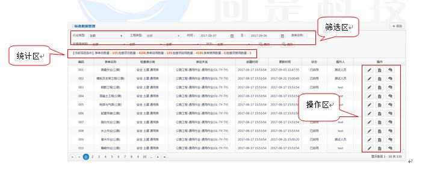 

A.1.<筛选区>选择<筛选条件>、选择<时间>、输入<表单名称> 

A.2.点击【查询】按钮，列表显示符合查询条件的表单记录 

A.3.点击【清空】按钮，将选择、输入的查询条件控件清空至初始状态 

B.<统计区>根据筛选结果统计表单、检查项数量及启用、禁用数量 

C.单击【添加】按钮，显示添加表单弹出框： 

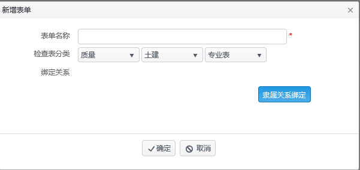 

C.1填写表单名称，选择<检查表分类> 

C.2.点击绑定关系图标，弹出绑定框： 

 

>温馨提示： 
>>1.绑定框中以“行业类型-工程类型-分部工程”的三集结构形式显示 
>>2.可选择到任何一级，选择行业类型或者工程类型可实现其下节点全选 
>>可选择多条记录绑定

C.2.1.选择节点，点击【确定】按钮，关闭绑定框，显示绑定信息在添加框的绑定关系一栏中 

C.3.单击添加表单框中【确定】按钮，保存新加表单 

>温馨提示： 

>>1.添加表单后创建时间和更新时间为保存时系统时间，精确到小时分钟秒 
>>2.新加的表单默认已启用状态

D.选中某一条表单记录，单击<操作区>中的图标，编辑界面同添加，此处略 

E.选中某一条表单记录，单击<操作区>中的按钮，弹出确认禁用提示框，点击【确认】，禁用该表单记录；点击【取消】按钮，取消此次禁用操作 

F.选中某一条表单记录，单击<操作区>中的按钮，弹出确认启用提示框，点击【确认】，启用该表单记录；点击【取消】按钮，取消此次启用操作 

G..选中某一条表单记录，单击<操作区>中的 按钮，打开表单内容新页面，如图： 

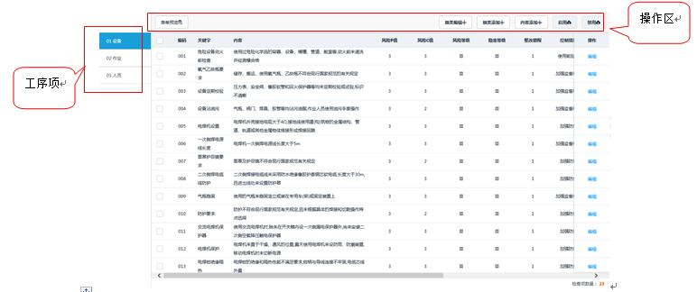 

>温馨提示： 
>>1.<工序项>显示进入的表单下所有的工序名称 
>>2.列表显示各工序下的检查项记录

G.1.单击<操作区>中【细类添加】按钮，弹出细类添加框： 

 

G.1.1.输入细类名称，点击【保存】按钮 

G.1.2.输入细类名称，点击【保存并继续】按钮，保存成功添加框仍显示可继续输入添加 

G.2.单击<操作区>中【细类编辑】按钮，弹出编辑框同添加，此处略 

G.3.单击<操作区>中【内容添加】按钮，弹出检查项添加框，如下图： 

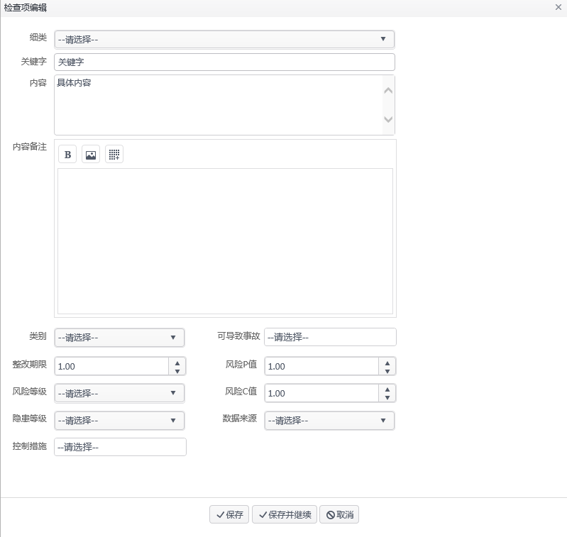 

>温馨提示： 
>>1.细类下拉框：显示该表单中所有的细类名称，默认“请选择” 
>>2.检查项添加框中除细类、关键字、内容、内容备注外，其他配置项为属性管理中已启用的记录，控件则是对应属性类型显示；候选项均为对应属性配置的内容中已启用的记录 
>>3.属性配置项均要求为必填项

G.3.1.填写、选择完整信息，点击【保存】按钮 

G.3.2.填写、选择完整信息，点击【保存并继续】按钮，保存成功可继续填写信息再次保存 

G.4.单击检查项列表区域中的操作列【编辑】，弹出检查项编辑框，同添加框，此处略 

G.5.选择检查项列表中的编码复选框，单击<操作区>中【启用】按钮，弹出确认启用提示框，确认后启用该检查项；否则取消启用操作 

G.6.选择检查项列表中的编码复选框，单击<操作区>中【禁用】按钮，弹出确认禁用提示框，确认后禁用该检查项；否则取消禁用操作 

>温馨提示： 
>>1.已启用的检查项不可再点击启用按钮；同理已禁用的检查项不可再点击禁用按钮 
>>2.可一次选择多条检查项进行启用或者禁用操作，即批量操作 

G.7.单击<操作区>中【表单预览】按钮，打开预览页面，如图： 

 

>温馨提示： 
>>1.查看该表单、其下所有的细类及对应检查项相关内容 
>>2.只可查看不可修改 

G.8.单击<工序项>中工序名称，切换点击，右侧检查项列表刷新显示切换的工序下的检查项记录
## 3.8. 数据导入
&ensp;&ensp;&ensp;实现以excel格式批量导入表单、工序、检查项数据
### 3.8.1.操作步骤
打开浏览器，输入项目网址，登录系统，单击菜单栏区域的[标准风险数据管理]→[数据导入]，进入“数据导入”主界面： 

 

A.单击【模板导出】按钮，导出excel文件，该文件内容如下： 

 

A.1该excel文件中填写各列内容，保存 

A.2点击【预览】按钮，选择保存的要导入的excel文件，确定后在页面中显示预览信息： 

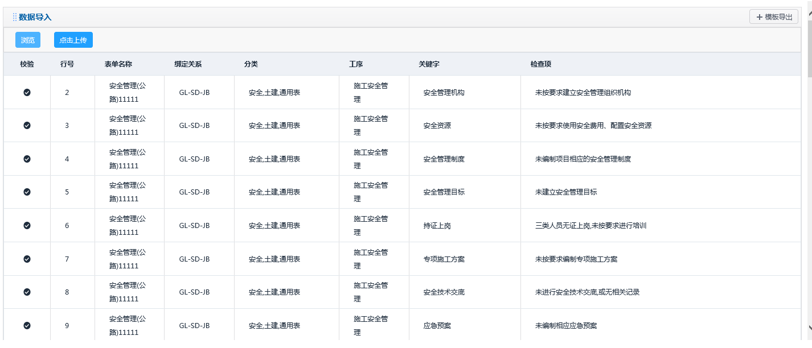 

>温馨提示： 
>>1.查看该表单、其下所有的细类及对应检查项相关内容 
>>2.只有所有记录中一条错误数据也不存在时才可导入，即【点击上传】按钮才可使用 

A.3点击【点击上传】按钮，上传成功弹出提示信息

## 3.9 版本变更记录管理
&ensp;&ensp;&ensp;&ensp;记录基础数据维护、标准数据维护所有添加、启用、禁用记录
### 3.9.1.操作步骤
打开浏览器，输入项目网址，登录系统，单击菜单栏区域的[标准风险数据管理]→[版本变更记录管理]，进入“版本变更记录管理”主界面： 

 

A.选择<筛选区域>中的时间，类型，输入操作人，单击【查询】按钮，列表显示符合查询条件的变更记录

## 3.10. 数据导入
&ensp;&ensp;&ensp;&ensp;实现版本记录维护
### 3.10.1.操作步骤
打开浏览器，输入项目网址，登录系统，单击菜单栏区域的[标准风险数据管理]→[版本管理]，进入“版本管理”主界面： 

 

A.1.<筛选区>选择<筛选条件>、选择<时间>、输入<操作人> 

A.2.点击【查询】按钮，列表显示符合查询条件的版本记录 

B.单击【新增版本】按钮，跳转到添加页面，如下图： 

 

B.1.填写<版本号>、<版本说明> 

B.2.单击【确定】按钮 

>温馨提示： 
>>1.“版本号”要求必须为数字加小数点类型，比如（1.0，1.0.1，1.0.0.1等），且不可重复 
>>2.“更新内容”文本框中的内容为自动生成，记录基础数据维护、基本数据管理维护及导入数据的详细信息，可不用修改直接使用 

## 3.11.平台项目配置
&ensp;&ensp;&ensp;&ensp;平台项目维护，包括添加、编辑、启用、禁用
### 3.11.1.操作步骤
打开浏览器，输入项目网址，登录系统，单击菜单栏区域的[项目风险数据管理]→[平台项目管理]，进入“平台项目管理”主界面： 

 

A.1.<筛选区域>选择<筛选条件>，输入<项目名称>、选择<启用状态> 

A.2.点击【查询】按钮，列表显示符合查询条件的平台配置记录 

B.单击【添加】按钮，弹出添加框，如下图： 

 

B.1.输入项目名称、项目入口、项目描述 

B.2.点击【确定】按钮 

C.单击<操作区>中【编辑】按钮，弹出编辑框同添加，此处略 

D.选中某一条项目记录，单击<操作区>中的按钮，禁用该项目记录 

E.选中某一条项目记录，单击<操作区>中的按钮，启用该项目记录 

## 3.12.项目数据管理
&ensp;&ensp;&ensp;&ensp;项目数据维护，可进行添加、编辑、启用、禁用操作
### 3.12.1.操作步骤
打开浏览器，输入项目网址，登录系统，单击菜单栏区域的[项目风险数据管理]→[平台项目管理]，进入“平台项目管理”主界面： 

 

A.1.<筛选区域>输入<项目名称> 

A.2.点击【查询】按钮，列表显示符合查询条件的项目数据记录 

B.单击【添加】按钮，弹出添加框，如下图： 

 

B.1.选择平台名称、属性，输入备注 

B.2.点击按钮，弹出绑定关系框，如下图： 

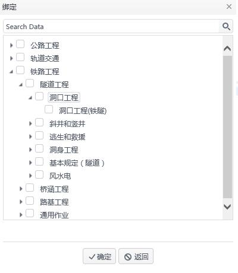

>温馨提示： 
>>1.绑定框中以“行业类型-工程类型-分部工程-表单”的四级结构形式显示 
>>2.可选择到任何一级，选择行业类型、工程类型、分部工程可实现其下节点全选 
>>3.可选择多条记录绑定 

B.2.1.选择节点，点击【确定】按钮，关闭绑定框，显示绑定信息在添加框的绑定关系一栏中 

>温馨提示： 
>>1.添加表单后创建时间和更新时间为保存时系统时间，精确到小时分钟秒 
>>2.操作人记录为当前添加记录的登录用户姓名 
>>3.新加的项目默认已启用状态 

C.选中某一条项目记录，单击<操作区>中的图标，编辑界面同添加，此处略 

>温馨提示： 
>>编辑框中平台名称不可修改 

E.选中某一条项目记录，单击<操作区>中的按钮，弹出确认禁用提示框，点击【确认】，禁用该项目记录；点击【取消】按钮，取消此次禁用操作 

F.选中某一条项目记录，单击<操作区>中的按钮，弹出确认启用提示框，点击【确认】，启用该项目记录；点击【取消】按钮，取消此次启用操作 

# 4.常见问题